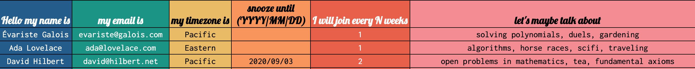

# Coffeebot Setup

Coffeebot runs as a Google Appscript script. This means you wil need a google (ie gmail) account to run coffeebot. To set up coffeebot you'll follow a few easy steps: 

1. Create a new Google Sheet spreadsheet
2. Copy-paste the script into that spreadsheets script-editor
3. Run the script to create the correct fields in the spreadsheet
4. Fill in your info into the spreadsheet
5. Run coffeebot!
6. Optionally, set a timer to run coffeebot automatically

Here's a detailed walkthrough of how to do those things:

## Set up a Google Sheet spreadsheet:

1. First, create a new spreadsheet:
    1. Go to drive.google.com
    2. Click the "New" button in the upper left hand corner
    3. Click the "Google Sheets" option in the drop down

2. Rename the spreadsheet from "Untitled spreadsheet" to whatever you like-- perhaps "Coffeebot"

## Add the coffeebot script

1. Click the "Tools" button in the toolbar, near the top of the spreadsheet
2. Select "Script Editor" from the drop down menu. This will open a new window.
3. Rename the script from "Untitled project" to whatever you like, perhaps "Coffeebot Script"
3. Delete the example script, and replace it by copy-pasting the coffeebot script:
    1. Open [dist/main.js](dist/main.js)
    2. Either highlight & copy the entire script, or click the "Copy file contents" clipboard icon in the upper right
    3. Paste into script editor 
4. Save the script (either by hitting cmd+S or by choosing "Save" from the "File" dropdown)

## Generate spreadsheet field names with coffeebot

1. In the script editor page, click the "Run" button in the toolbar.
2. Mouse over "Run function" in the drop down; you will see three functions appear in a secondary drop-down to the right. 
3. Click on the first one; `setupSignupSheet`.
4. You will get a notification reading "Authorization required". 

This script will need to read and write the spreadsheets you set up, and send emails from your email account, so you need to explicitly give it permission to do that.

If you feel uncomfortable granting this script those permissions, you could create a new gmail account (they're free, and you can have as many as you like) and set up coffeebot to run on that dedicated gmail account to isolate it from any other data you may have in your google account. If you are a programmer familiar with javascript you could also read the script to verify that it only reads / writes this coffeebot spreadsheet and only sends emails relevant to coffeebot.

5. Hit "Review Permissions", and then hit "Allow".
6. If you go back to the spreadsheet, you will see that there is a new sheet named "Signup" that has some field names populated.

## Populate the spreadsheet

Here is what each of the fields is used for:
- name: used at the top of the email to address the person receiving the email
- email: coffeebot sends the message to this address
- timezone: included in the email; the intention is to provide the participants more context for scheduling their coffeechat
- snooze until (YYYY/MM/DD): lets participants pause their participation in coffeebot until the specified date. 
- cadence: specifies how often participants want to participate. The default cadence is 1. Coffeebot bases the cadence off of the assumption that it runs weekly, so if a user sets their cadence to 2 it means they'd like to participate every-other-week, if they set it to 3 it means they'll be included every third week.
- topics: included in the email as a list of topics that each participant is interested in. These aren't meant to be a prescriptive list of what the coffeechat must be about, but are meant as a possible starting point.

You'll need to populate at least two users to test out coffeebot; use your email address and the email address of a friend so that you can confirm that you received the coffeebot email when you run it.

You can name the fields whatever you wish (ie, you can write "Hello my name is" instead of "NAME") but the script expects all of that information to be present in that order so it is important that you don't change the order of any of the columns or delete columns.

Here's how our version of the spreadsheet looks:


If you'd like to replicate our look-and-feel, here is how it is configured:
- the headings are in Lobster, size 14 bold
- the body is in Inconsolata, size 12
- the hex codes for the column colors left-to-right are: 336699, 2A9D8F, E9C46A, F4A261, E76F51, F39A9D

## Run coffeebot 

Coffeebot runs in two steps to help make it easier to debug in case anything goes wrong. The first step is generating pairings for participants, and the second step is sending emails based on those pairings. We'll need to run each of those two functions. The two functions we need to run show up at the bottom of the list of all functions.

1. In the script editor page, click the "Run" button in the toolbar, and select `generateNextPairings` from the "Run function" secondary drop-down.

2. If you look at the spreadsheet, you'll see a new sheet called "Next Pairings". It should now show that the two users are paired for an upcoming coffeechat.

If there is an even number of people, everyone is paired up in a group of two. If there is an odd number of people, coffeebot creates one group of three in addition to all the pairs.

3. Go back to the script editor, and select `sendEmails` from the "Run function" secondary drop-down.

4. If you replaced the example email addresses with your email address and a friend's email address, both of you should now have an email in your inbox. It looks like this:

```
Hey Évariste Galois & Ada Lovelace!

You're invited to chat over coffee this week!  

Don't like coffee? [1 of 4 responses inserted, such as: "Me either. Just drink some other liquid!"]

When scheduling a time to chat, please mind everyone's timezones, which are: Pacific, Eastern

What should you talk about? Well that's up to you, but maybe you could talk about: solving polynomials, duels, gardening, algorithms, horse races, scifi, traveling

P.S.
[1 of 7 coffee jokes inserted at random, such as, "Drinking too much espresso can cause a latte problems."]

Happy chatting!
Coffeebot ☕🤖
```

If you want to change what the email says, you can do so by editing the text in the `generateEmail` function of the script.

## (Optional) Set up Coffeebot to run on a timer

If you'd like to run coffeebot automatically at regular intervals, you can set it to run on a timer. Below are instructions to set it to run once a week, which you can adapt for any other time period:

1. Go to the script editor window.
2. Click on the "Current project's trigger" button which looks like a pin with a clock in it. It is to the right of the floppy disk icon, and to the left of the "Run" triangle. This will take you to a new window.
3. In the "Triggers" window, click on the "create a new trigger" button, which should be right under the magnifying glass in the middle of the page. This will pop up a window with a few dropdown menus.
4. Configure the dropdowns:
    1. "function to run" should be `generateNextPairings`
    2. leave "which deployment should run" as is
    3. "select event source" should be "Time-driven". Selecting this option will reveal some additional fields. 
    4. "select type of time based trigger". You can set this to be however often you like, but the "cadence" feature assumes a weekly cadence, so using the "week timer" is recommended.
    5. Configure day of the week & time of day as you like.
        You can set it to run at some day / time in the near future to test the functionality, and then reset it to whichever date and time you truly want to use.
    6. You can leave "failure notification settings" as is, or set it to "Notify me immediately".
    7. Hit "Save" to create the trigger.
5. Hit the "+ Add Trigger" button in the lower right, and repeat step 4, but for the "sendEmails" function. Be sure to schedule the `sendEmails` function to run at a time later than the `generateNextPairings` function.
